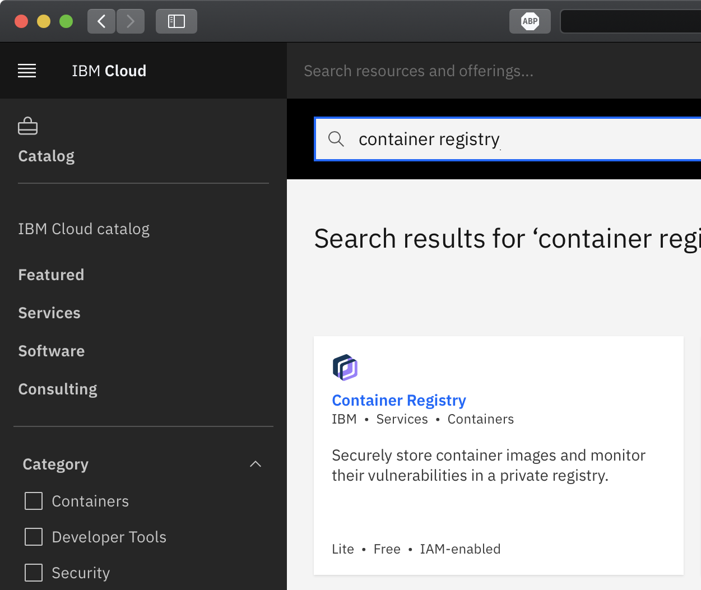
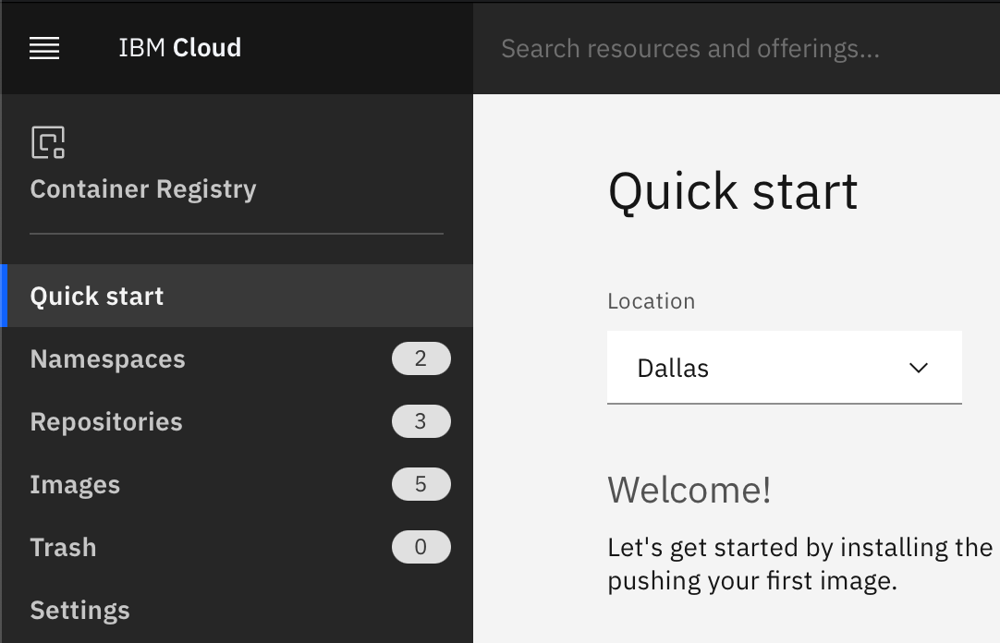
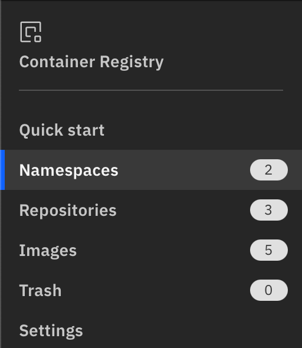
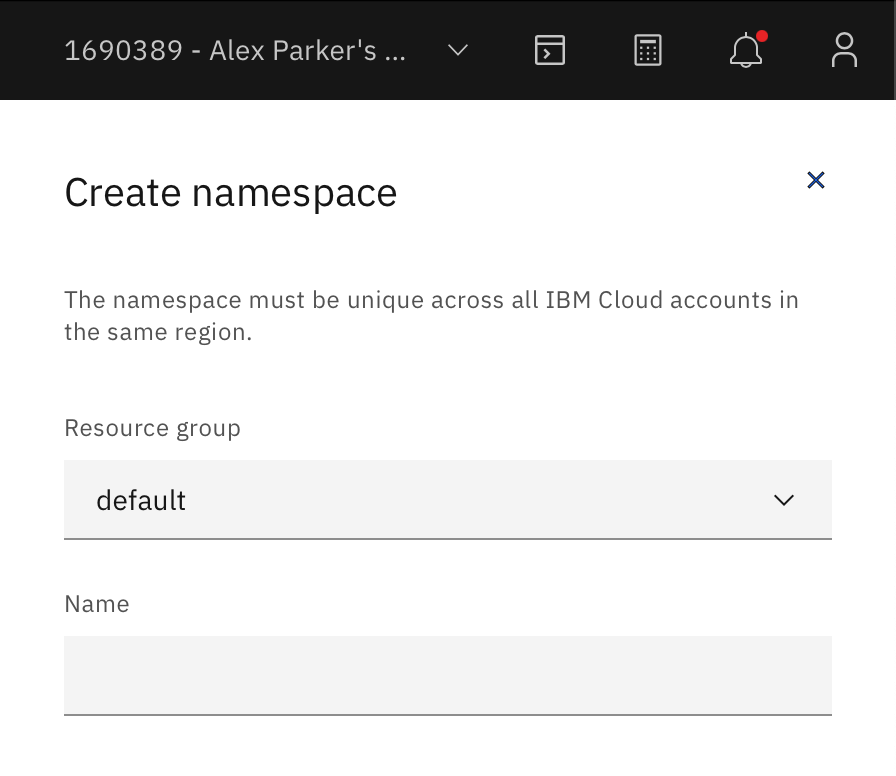

# Creating an IBM Cloud Container Registry Namespace

## Objectives

After completing this lab, you will be able to:

-   Describe the IBM Cloud Container Registry service
-   Create a Container Registry namespace

## Lab Overview

In this lab you will create an IBM Cloud Container Registry namespace, which you will use in a subsequent labs.

## Pre-requisites

You will need an IBM Cloud account to do this lab. If you have not created one already, click on this [link](https://cf-courses-data.s3.us.cloud-object-storage.appdomain.cloud/IBM-CC0100EN-SkillsNetwork/labs/IBMCloud_accountCreation/CreateIBMCloudAccount.md.html) and follow the instructions to create an IBM Cloud account.

## About IBM Cloud

The IBM Cloud platform is deployed across data centers around the world. It combines platform as a service (PaaS) with infrastructure as a service (IaaS) to provide an integrated experience. The platform scales and supports both large enterprise businesses and small development teams and organizations.

The platform is built to support your needs, whether it's working only in the public cloud or taking advantage of a multicloud deployment model. IBM Cloud offers a variety of services, including Compute, Network, Storage, Management, Security, Databases, Analytics, AI, and Cloud Paks.

## About IBM Cloud Container Registry namespaces

IBM Cloud Container Registry is a multi-tenant registry in the public cloud. Namespaces are used to provide isolation for users' images. The namespace is a slice of the registry to which you can push your images. The namespace will be a part of the image name when you tag and push an image. For example, `us.icr.io/<my_namespace>/<my_repo>:<my_tag>`.

# Create a Container Registry namespace

1.  Go to the [IBM Cloud catalog](https://cloud.ibm.com/catalog?utm_medium=Exinfluencer&utm_source=Exinfluencer&utm_content=000026UJ&utm_term=10006555&utm_id=NA-SkillsNetwork-Channel-SkillsNetworkCoursescc20117568655-2021-01-01) page.
    
2.  In the **Search the catalog…** box, type `Container Registry` and press Enter on your keyboard.
    
3.  Click the **Container Registry** tile in the search results. 

4.  You can now read about the Container Registry service and visit links for API documentation and docs about how to use the service. 

5.  At the top right, click **Get started**.

6.  Ensure that the location is set to **Dallas**. 

7.  Click the **Namespaces** tab. 

8.  On the right side of the Namespaces panel, click **Create**. A **Create namespace** panel opens.

9.  In the **Resource group** field, select the name of the resource group you would like this namespace to reside in. For this lab, you can simply leave the selection as **default**.

10.  In the **Name** field, type a unique name for the namespace. The name must be unique across all users of the Container Registry service in this region. 

11.  Click **Create** at the bottom of the panel to create the namespace.

You now have a namespace to which you can push images.

Congratulations! You have completed the first lab for the first module of this course.
